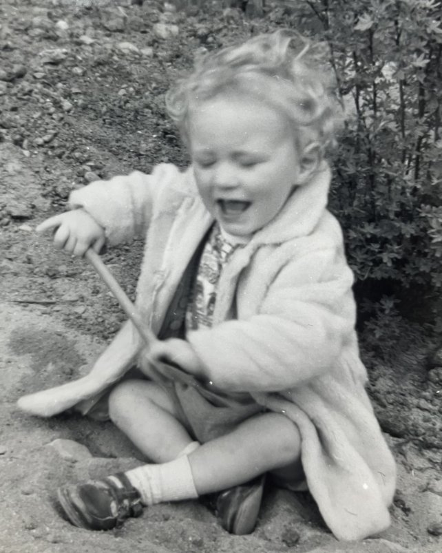

=========
 Bingley
=========

This story begins in the Yorkshire town of Bingley.

It is where I spent my early years.

   
   starting the journey to Australia

   Dad had mentioned Australia is close to the antipodal point, so
   obviously I had to go there.
   
It was a few years later, looking up at the sky and asking mum (or was
it dad) if it goes on forever?  It must stop, but then what comes
next, so maybe it never stops?

It is the same town in which Fred Hoyle spent his early years.  There
is now a road named Fred Hoyle Way.

Mum liked Fred.  I expect she had heard him on the radio.  A blunt
Yorkshireman that was not afraid to tell the establishment he thought
they were wrong.

It was Fred that coined the term Big Bang.  Fred looked at the
Universe through the biggest telescopes of the day.

.. image:: images/m31.png

   The Andromeda Galaxy

   Our view of the universe in Fred Hoyle's time

Like Einstein, he believed the Universe was likely ancient and vast.
He believed in the perfect Copernican Principle: the universe looks
pretty much the same, wherever you are, and has done so for a very
long time.

It can be paraphrased as, "there are no special times or places in the
universe".

Hoyle proposed that the observed expansion could be balanced by the
spontaneous creation of a modest amount of matter, just one atom per
sky-scraper sized volume of space, per year.

The idea never caught on.

You could never ask mum a question she would not attempt to answer.
She usually waited to be asked, before expressing an opinion.

Dad talked about things he was interested in.

I do not recall either expressing an opinion on the Big Bang.

It was definitely my dad that bought the copy of Fred's, :ref:`notu`,
that I re-discovered in 2017, shortly before I learnt of Colin
Rourke's work in cosmology, when he published `A new paradigm for the
universe <https://arxiv.org/abs/astro-ph/0311033>`__.

I do recall a school friend talking about black holes back in those
days.  It was the first time I had heard they might actually exist.

The cosmic microwave background, gamma-ray bursts and quasars had only
just been discovered.
