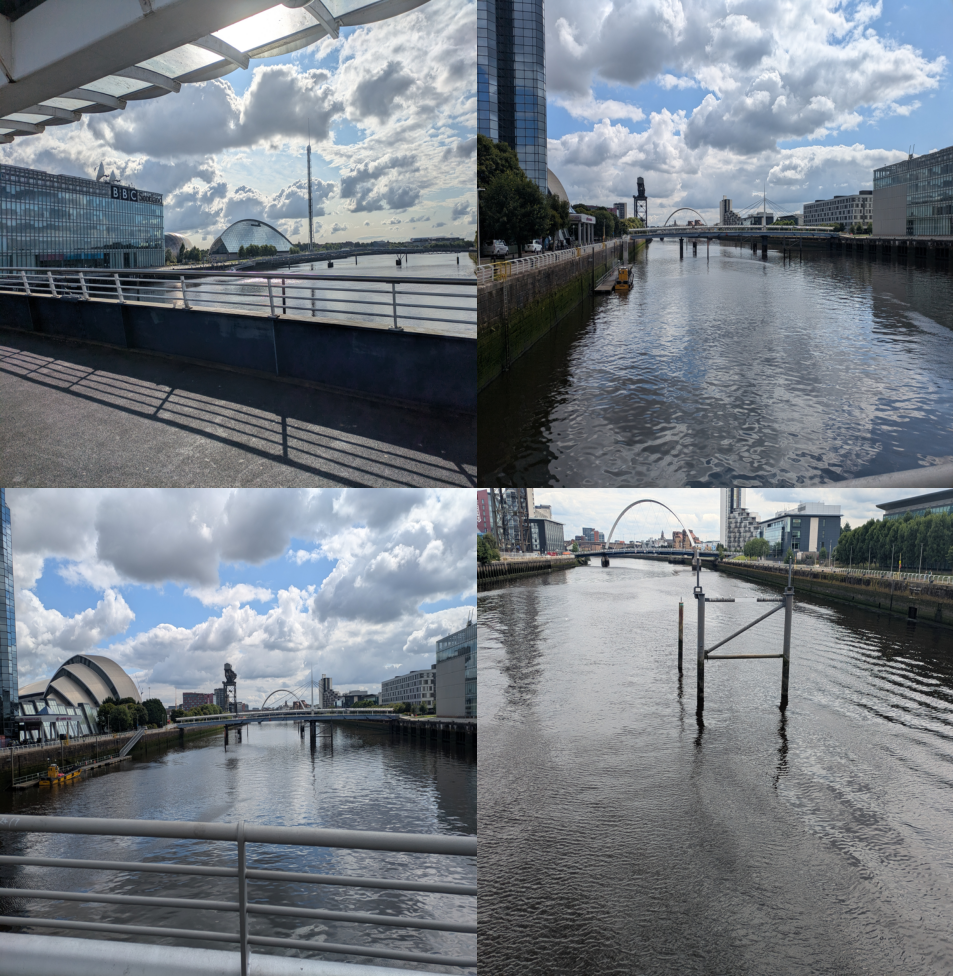

Early Career Workshop
=====================

Despite my advanced age, I felt it would be worthwhile to attend the
early career workshop before the main conference.

It was excellent to have an opportunity to really get to understand
the current state of research into gravitational waves.

It was a good way to get to understand the community working on
gravitational wave science.

GW231123
========

This wave is believed to originate from two inter-mediate mass black
holes, from an area known as the mass-gap.

The issue here is that inspirals take a long time to actually happen,
if they happen at all.  And with a big bang, there is not sufficient
time for multiple generations of mergers.

Parameter Distribution
======================

There was an excellent talk on the distribution of parameters, such as
the masses involve, and the distance of events.

With the number of detections in the hundreds, some intriguing
features are starting to emerge.

There are more detections per unit volume, the further out you go.

Another interpretation is that weaker signals dominate the sample.

There are more weak waves than stronger ones.

If the wave is proportional to the mass of the arriving quasar or
galaxy, then we would indeed expect more smaller than large objects.

Pulsar Timing Array
===================

More data on this experiment would be good to work with.

I have a growing interest in binary pulsars.

Sciama, Kerr and the Hulse-Taylor pulsar
========================================

I had an interesting conversation with Christopher Berry.  I mentioned
how much admiration I had for all the people who worked on
gravitational wave detectors, in some cases for decades, searching for
a signal that may not exist.

Christopher commented::

  We had the observations of binary pulsars.

Specifically, the Hulse-Taylor binary, where the system is showing
slow orbital decay, consistent with the angular momentum it should
lose due to general relativity, according to the Kerr metric.

The idea is that rotation causes angular momentum to radiate away in
the form of gravitational waves.  The Kerr metric defines how much
angular momentum is radiated in this way.

The assumption is that orbitting objects will, eventually, decay to
the point that they inspiral and coalesce into a single black hole.

Why this might not happen
-------------------------

The Kerr metric analysis and Hulse-Taylor observations is
sound.

A rotating body drags space-time around with it, but it also feels
that drag of the rest of the universe, and slows accordingly.  

Now having created a wave in space, the wave itself propogates
according to the Sciama Principle.  It's magnitude drops with 1/r.

Further, only the wavelength, or angular velocity matters, angular
momentum is not a factor, other than it determines the amplitude of
the Kerr effect.

Sciama says frame dragging drops off with 1/r, Kerr says it is 1/r**3.
Both are correct.

The resolution to this conundrum is to recognise that the rotation
creates a wave in the fabric of space-time, according to the Kerr
metric, but that distortion of space-time then propogares according to Sciama.

Gravitational waves are assumed to propagate at the speed of light (1
part in 10-15 difference according to GW170817), with amplitude
reducing with a 1/r relationship, per Sciama.

Conservation of angular momentum in curved space time
-----------------------------------------------------

There is a geometric proof of conservation of angular momentum that
relies on certain triangles having the same area.  The proof is a
theorem of Euclidean Geometry.  In a curved space-time, angular
momentum is not, in general, concerved.

Of course, in many cases curvature is small enough that space can be
consider to be Euclidean, to first order.

The River Clyde Gravitational Observatory
=========================================

After mornings listening indoors it was good to take a lunch time
work, along the banks of the river Clyde and over a pair of
foot-bridges.

On one of my walks, a boat had recently passed down the river, it's
wake was now bouncing side to side across the river.

This part of the river is deep, with straight sides, causing waves to
reflect of the sides.

There was also a light wind blowing.

Therapy dogs
------------

The conference had organised *therapy dogs* for the Wednesday
lunchtime, a nice idea, but I had not booked a slot.

Fortunately, there were many therapy dogs enjoying their lunch time
walks. 

Afternoon in the Launderette
============================

Tensions in cosmology
=====================

DESI in the LRG at redshift 0.7
-------------------------------

Essentionally, in the DESI dataset, if you assume redshift gives
distance then the 0.7 bucket is out of whack with the scale factor we
would assume.

In Rourke's model many of the LRG are relatively near objects, but
with significant intrinsic redshift from the AGN.

Priors
======

Bayesian probability is in wide use through the community and there is
considerable awareness of the problems that can arise with priors.

I particularly enjoyed the talk on biases from choice of m1 in a
merger. (which talk?)

What prior should be used for, what if Colin, Fred and Jayant were
right?

The Perfect Copernican Principle?

It that holds, then quasars must have intrinsic redshift.  The little
red dots of JWST fame too.

Gamma-ray bursts and the cosmic microwave background?

Unravelling the spectral information from DESI should help provide
mass distribution for arriving quasars and galaxies.

Prior distribution on mass of arrivals?

Art Exhibition
==============

**Where is the Sun?**

My submition to the art exhibition for the conference was displayed.

.. figure:: images/witsart.png

     Where is the Sun?

Caption at gr24::

       Two visualisaltions of the Milky Way rotation curve using Gaia
       data.
       Lower assumes Sagittarius A*, lower assumes it is twice as far
       away, as Professor Rourke suggest it is too small to drive a
       galaxy.

The typos were all mine.

The work shows two matplotlib images generated using data from the
European Space Agency's Gaia satellite to visualise the Milky Way's
rotation curve: the relationship between distance from the galactic
centre and tangential velocity, for stars in the Milky Way.

Different matplotlib colormaps were used for the two plots,
high-lighting the need to consider the blue as well as the reds.

In both plots, the Sun is at the dense part of the plot, some
26,000 light-years from Sagittarius A*.

If you align the two plots, we see general agreement, the question
is what we see in the blue a reflection of the red about Sgr A*?

The images are created by dividing the distance and tangential
velocity into a grid and counting how many observations are in
each grid square.

To create an image, we need values in the range 0 - 1, so some
sort of nomralisation is needed.   In these image, each column is
divided by the sum of the values in that column.  The columns
correspond to distances.

So for each distance, we see the proportion of stars with each
velocity.   

One of Rourke's boldest predictions, that Sagittarius A* is not large
enough to drive a galaxy the size of the Milky Way, arguing that a
mass of 1-100e9 solar masses would be required.

He argued that it just happened to be in the direction of the true
centre.  

In both images, the sun is in the area where there are most
observations.

There are a number of striking features to both plots.

Near the centre we see plate-like rotation, velocity proportional to
distance from the centre, at Sagittarius A*, the velocity is zero.

Further out, we see a flat asymptote, with a tangential velocity of
200km/s.

Beyond 50,000 light years or so, things get more complex.   The most
likely value at a given distance tends to drop a little.   However,
there are many other objects which are moving faster than we would
expect.

It is like there is a general fanning out as stars have more time for
random motions to accumulate and generally there is increasing spread
from the 200 km/s assymptote predicted by Rourke's model.

Calculating the Hubble constant from observations
=================================================

Part of the problem is determining the host galaxy for a merger.

Localisation is generally poor and galaxy catalogs are incomplete.

More observations will help.

Did the conference change my priors?
====================================

The Future
==========

August: O4a data release.  Need a model to fit/estimate parameters.

HMXW - half max width for spectra (check acronym in little red dot
paper).  Use on DESI via spectral matching stuff.

DESI will give distribution of galaxy masses, which will help with
simulation of nanohertz waves to compare with PTA observations.

Sgr A* location.

Sciama waves.

Hulse-Taylor and a Milky Way model.

Redshift
========

The Eddington sphere can be arbitrarily close to the black hole, the
distance depending on the temperature and density of the medium.

All things being equal, smaller black holes can exhibit significant
intrinsic redshift.

In short, not all redshift is cosmological.

   
Ammonite
========

I wore a pendant of an ammonite fossil on occasion at the conference.

It was a slice through an ancient creature that had grown slowly over
time, bigger and bigger spirals.

I had hoped it might spark discussions of how spiral galaxies grow.
Slow acretion over time or mergers of smaller objects?

How do ammonites grow?

Curiously, during the conference, the discovery of a new Sedna object
was announced, with the new object nicknamed Ammonite.
