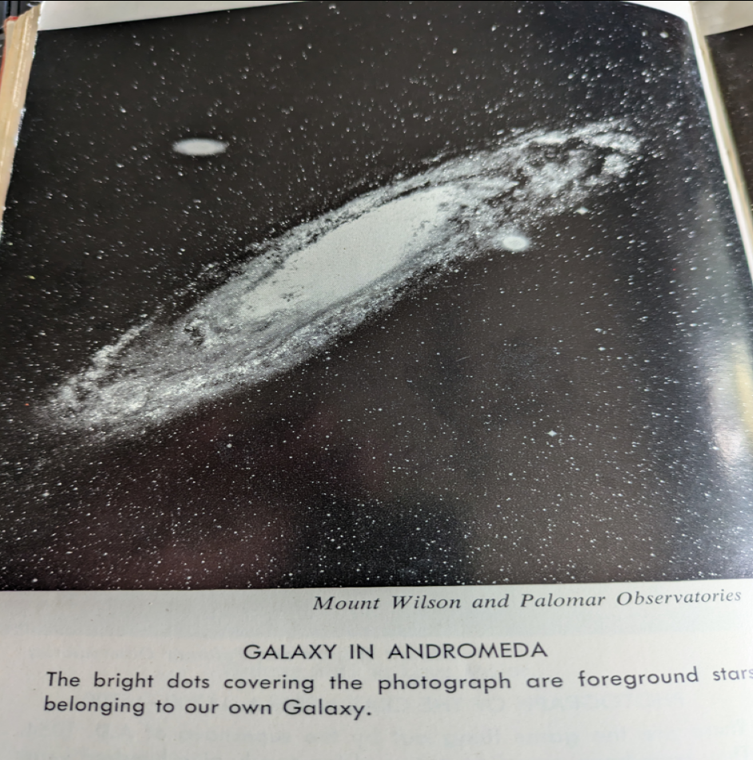
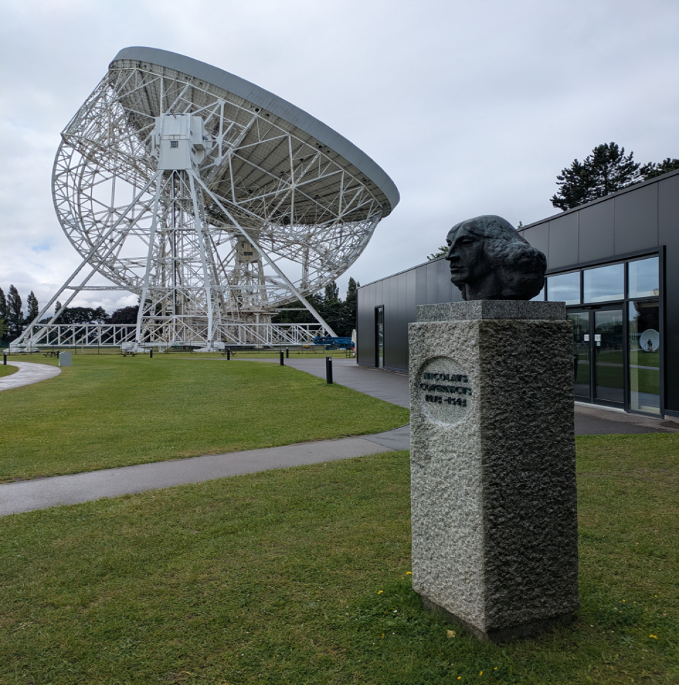
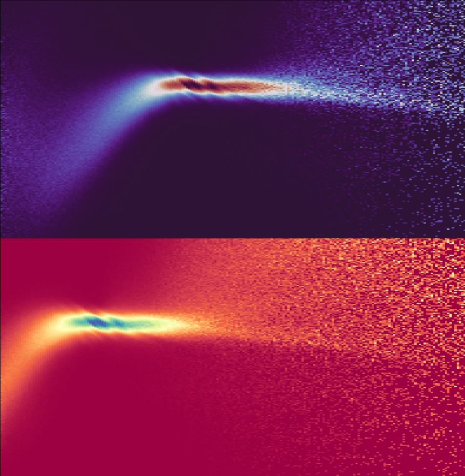

===================
 GR24 and Amaldi16
===================

**A quest from Bingley to Glasgow in search of the truth of
gravitational waves**

.. toctree::
   :maxdepth: 2

   bingley
   jodrell
   warwick
   glasgow
   gw170817
   binary

This story begins in the Yorkshire town of Bingley.

.. image:: images/gr24/bingley.png

It is where I spent my earlier years.  In the image above I am on a
mission to dig a whole to Australia.  Dad had mentioned Australia is
close to the antipodal point, so obviously I had to go there.

It was a few years later, looking up at the sky and asking mum (or was
it dad) if it goes on forever?  It must stop, but then what comes
next, so maybe it never stops?

It is the same town in which Fred Hoyle spent his early years.  There
is now a road named Fred Hoyle Way.

Mum liked Fred.  I expect she had heard him on the radio.  A blunt
Yorkshireman that was not afraid to tell the establishment he thought
they were wrong.

It was Fred that coined the term Big Bang.  Fred looked at the
Universe through the biggest telescopes of the day.

Like Einstein, he believed the Universe was likely ancient and vast.
He believed in the perfect Copernican Principle: the universe looks
pretty much the same, wherever you are, and has done so for a very
long time.

It can be paraphrased as, "there are no special times or places in the
universe".

Hoyle proposed that the observed expansion could be balanced by the
spontaneous creation of a modest amount of matter, just one atom per
sky-scraper sized volume of space, per year.

The idea never caught on.

Observations of quasars, by radio telescopes were interpretted as
extremely powerful, very distant objects, from an early stage of the
universe.

Jodrell Bank
============

I visited one of the world's radio telescopes and was delighted to
find statue of Copernicus at the site.

Jodrell Bank was heavily involved in the early explorations of
quasars.

As we do not see such objects near to home, this helps strengthen the
Big Bang theory.

The cosmic microwave background was observed around the same time, and
again interpretted through the lens of the Big Bang theory, becoming
one of the three pillars of the theory.

Gamma-ray bursts similarly hint of dramatic events in the early
universe, but also provide explanations for some mysteries such as how
we got so many heavy elements in such short a time?

After my early years in Bingley, I went to study mathematics at
Warwick University.  My personal tutor was Professor Colin Rourke.

He taught undergraduate analysis, using a method he had developed for
the Open University. 

I graduated with first class honours, but it was not until 2017 that I
discovered Professor Rourke's work in cosmology.

He published, "A new paradigm for the universe".  A second edition
under the title, "The Geometry of the Universe" was published in 2021.

In this work he presents a model for the universe with no need for
dark matter and no Big Bang!

I obtained a copy of the book and was enthralled.  As an
under-graduate I had rarely spoken to Professor Rourke, other than to
let him know where I was living.

I plucked up the courage to contact him about the book and to my
immense delight it was the beginning of a wonderful correspondence as
he guided me through his perspective on the universe.

With no big bang, there is also ample time for galaxies to grow, by
slow acretion of matter to their central black holes.  Galaxies
giving birth to baby galaxies, which may one day grow into galaxies
themselves, or a globular cluster perhaps?

The Sciama Principle is proposed, as an addition to General
Relativity, to explain galactic rotation curves without recourse to
dark matter.

The same principle allows central black holes to absorb angular
momentum from inflowing matter and so no need for complex acretion
disk theories.

It is also just a theorem about the propogation of gravitational
waves: that their amplitude reduces as 1/r, where r is the distance
from the source.  This is widely accepted in the community and is
usually used to calculate the distance of the source, usually
expressed as redshift, with a Hubble-law.

Outline
=======

Now imagine in the 1960's Fred's idea of the continuous arrival of new
matter arriving in our visible universe, at exactly the rate required
to balance the observed expansion.

What would that universe look like?

This is the view Rourke provides.  He uses *de Sitter Space*, in which
pairs of geodesics eventually separate exponentially, in both forwards
and backwards time.

It is a natural first model for a universe, one with constant
curvature.  New galaxies are constantly arriving in our backwards
light cone, and do so highly redshifted as gamma-ray bursts.  It is
not new matter, spontaneously created, it has existed a very long
time, but has only just now entered our visible universe.  We will see
it until the end of time.

The waves we are seeing are not drammatic in-spirals of black holes,
but are the result of the same modulation of gravitational waves
generated by the central black holes of galaxies.

Earlier in the year I submitted a proposal to this conference in
Glasgow about general relativity and gravitational waves :ref:`birch`.

   Is there anything else?  Colin Rourke, on light.

   The CMB and gravitational waves should be in equilibrium due to the
   Rees-Sciama effect?

   When an old guy from a ski school, who believes the big bang did
   not happen attended an astrophysics conference.

After submitting the talk, I realised the subject was a little more
complex than I had hoped, requiring not just de Sitter Space, but also
the model of galaxy evolution outlined in Rourke's work, where
galaxies are characterised by the size of their central black holes.

The release of data from the Dark Energy Spectroscopic Instrument
has provided ideal data to help determine the split between
cosmological and intrinsic redshift.

The key idea is that smaller black holes exhibit intrinsic redshift,
with light coming from close to the black hole.  As the central black
hole and galaxy grow the redshift diminishes and is negligble in a
full size galaxy.

The talk was not accepted, which was somewhat of a relief.  It has
taken me some time to understand what is going on with galaxy spectra.

I had also made the submission before I heard the very sad news that
Colin Rourke had passed away.

I decided I would still attend the conference, as it gave an ideal
opportunity to get the latest information on gravitational wave
observations and next generation detectors.  I was not disappointed.

Rourke ends chapter for of The Geometry of the Universe with a
*coda*::

  Sciama's initiative to base a dynamical theory on Mach's
  principle as formulated in Sciama's principle, has never
  been followed up and this approach to dynamics remains
  dormant.  One of the aims of this book is to reawaken
  this approach.

It is my belief that the Sciama principle is the best explanation of
the gravitational waves that both the Pulsar Timing Array and the
LIGO, Virgo and Kagra detectors are seeing.

As I am not in academia, I listed my institution as *Académie Camp
Fortune, Chelsea, Quebec*, where I work as a ski instructor doing
practical experiments in gravity, in a low friction environment.

I am fortunate that this gives me a great deal of time to ponder the
mysteries of the universe.

Early Career Workshop
=====================

Despite my advanced age, I felt it would be worthwhile to attend the
early career workshop before the main conference.

It was excellent to have an opportunity to really get to understand
the current state of research into gravitational waves.

GW170817
========

Everybody's favourite wave.

1.7 second delay between merger and light, of the order of the
distance between the earth and the moon.

It is long overdue for me to fit a model to this observation, based on
the arriving galaxy model.

144 million light years away, or 1% of the Hubble distance.

A 1.7 second delay over this distance gives a speed difference of less
than one part in 3.74e-16.

Now in the arriving galaxy model,  the distance is 100 times greater
and we get 3.7e-18 as the potential difference in the speed of light
and the speed of gravitational waves.

CMB oddity
----------

This is commensurate with the size of the Sciama effect expected for
the CMB: all the photons of the CMB induce a rotation on the
surrounding space-time.

A tiny ripple.  It is not that light travels slower, rather, it
travels further.

Gravity waves of a given frequency all travel at the speed of light,
but light itself follows all the tiny wrinkles.

If this is what is happening the 1.7 seconds should turn out to be
quite consistent across observations.

In the arriving galaxy model, we see a speeded up version of the
galaxy's history, so the light is averaged across lots of time.  As
such we should expect the peak to be very close to the galactic
centre.

::

   >>> 144e6 * u.lightyear / sp.cosmo.hubble_distance
   <Quantity 0.00996433>
   >>> 1.7 * u.s / u.year 
   <Quantity 1.7 s / yr>
   >>> _.decompose()
   <Quantity 5.38697493e-08>
   >>> 1.7 * u.s / 144e6 * u.year 
   <Quantity 1.18055556e-08 s yr>
   >>> 1.7 * u.s / (144e6 * u.year )
   <Quantity 1.18055556e-08 s / yr>
   >>> _.decompose()
   <Quantity 3.74095481e-16>
   >>> _ * (144e6 * u.lightyear / sp.cosmo.hubble_distance)
   <Quantity 3.72760915e-18>
   

GW231123
========

This wave is believed to originate from two inter-mediate mass black
holes, from an area known as the mass-gap.

The issue here is that inspirals take a long time to actually happen,
if they happen at all.  And with a big bang, there is not sufficient
time for multiple generations of mergers.

Parameter Distribution
======================

There was an excellent talk on the distribution of parameters, such as
the masses involve, and the distance of events.

With the number of detections in the hundreds, some intriguing
features are starting to emerge.

There are more detections per unit volume, the further out you go.

Another interpretation is that weaker signals dominate the sample.

There are more weak waves than stronger ones.

If the wave is proportional to the mass of the arriving quasar or
galaxy, then we would indeed expect more smaller than large objects.

Pulsar Timing Array
===================

More data on this experiment would be good to work with.

I have a growing interest in binary pulsars.

Sciama, Kerr and the Hulse-Taylor pulsar
========================================

I had an interesting conversation with Christopher Berry.  I mentioned
how much admiration I had for all the people who worked on
gravitational wave detectors, in some cases for decades, searching for
a signal that may not exist.

Christopher commented::

  We had the observations of binary pulsars.

Specifically, the Hulse-Taylor binary, where the system is showing
slow orbital decay, consistent with the energy it should lose due to
general relativity, according to the Kerr metric.

The idea is that rotation causes energy to radiate away in the form of
gravitational waves.  The Kerr metric defines how much angular
momentum is radiated in this way.

The assumption is that orbitting objects will, eventually, decay to
the point that they inspiral and coalesce into a single black hole.

Why this might not happen
-------------------------

First the Kerr metric analysis and Hulse-Taylor observations seem
sound.

A rotating body drags space-time around with it, but it also feels
that drag and slows accordingly.

Now having created a wave in space, the wave itself propogates
according to the Sciama Principle.  It's magnitude drops with 1/r.

Further, only the wavelength, or angular velocity matters, angular
momentum is not a factor.

Sciama says frame dragging drops off with 1/r, Kerr says it is 1/r**3.

Kerr assumes space-time is a vacuum and is the unique solution for a
vacuum.

Gravitational waves are assumed to propagate at the speed of light (1
part in 10-15 difference according to GW170817), with amplitude
reducing with a 1/r relationship, per Sciama.

Conservation of angular momentum in curved space time
-----------------------------------------------------

There is a geometric proof of conservation of angular momentum that
relies on certain triangles having the same area.  The proof is a
theorem of Euclidean Geometry.  In a curved space-time, angular
momentum is not, in general, concerved.

Of course, in many cases curvature is small enough that space can be
consider to be Euclidean, to first order.

The River Clyde Gravitational Observatory
=========================================

Therapy dogs
------------

Afternoon in the Launderette
============================

Tensions in cosmology
=====================

DESI in the LRG at redshift 0.7
-------------------------------

Essentionally, in the DESI dataset, if you assume redshift gives
distance then the 0.7 bucket is out of whack with the scale factor we
would assume.

In Rourke's model many of the LRG are relatively near objects, but
with significant intrinsic redshift from the AGN.

Priors
======

Bayesian probability is in wide use through the community and there is
considerable awareness of the problems that can arise with priors.

I particularly enjoyed the talk on biases from choice of m1 in a
merger. (which talk?)

What prior should be used for, what if Colin, Fred and Jayant were
right?

The Perfect Copernican Principle?

It that holds, then quasars must have intrinsic redshift.  The little
red dots of JWST fame too.

Gamma-ray bursts and the cosmic microwave background?

Unravelling the spectral information from DESI should help provide
mass distribution for arriving quasars and galaxies.

Prior distribution on mass of arrivals?

Art Exhibition
==============

**Where is the Sun?**

My submition to the art exhibition for the conference was displayed.

The work showed two matplotlib images generated using data from the
European Space Agency's Gaia satellite to visualise the Milky Way's
rotation curve: the relationship between distance from the galactic
centre and tangential velocity, for stars in the Milky Way.

The two images choose a different point for the galactic centre.

The lower, red image places the centre as Sagittarius A*, at 26,000
light years.  The upper images assumes the centre is twice as far
away.

In both images, the sun is in the are where there are most
observations.

There are a number of striking features to both plots.

Near the centre we see plate-like rotation, velocity proportional to
distance from the centre.

Further out, we see a flat asymptote.

Calculating the Hubble constant from observations
=================================================

Part of the problem is determining the host galaxy for a merger.

Localisation is generally poor and galaxy catalogs are incomplete.

More observations will help.

Did the conference change my priors?
====================================

The Future
==========

August: O4a data release.  Need a model to fit/estimate parameters.

HMXW - half max width for spectra (check acronym in little red dot
paper).  Use on DESI via spectral matching stuff.

DESI will give distribution of galaxy masses, which will help with
simulation of nanohertz waves to compare with PTA observations.

Sgr A* location.

Sciama waves.

Hulse-Taylor and a Milky Way model.

Redshift
========

The Eddington sphere can be arbitrarily close to the black hole, the
distance depending on the temperature and density of the medium.

All things being equal, smaller black holes can exhibit significant
intrinsic redshift.

In short, not all redshift is cosmological.
