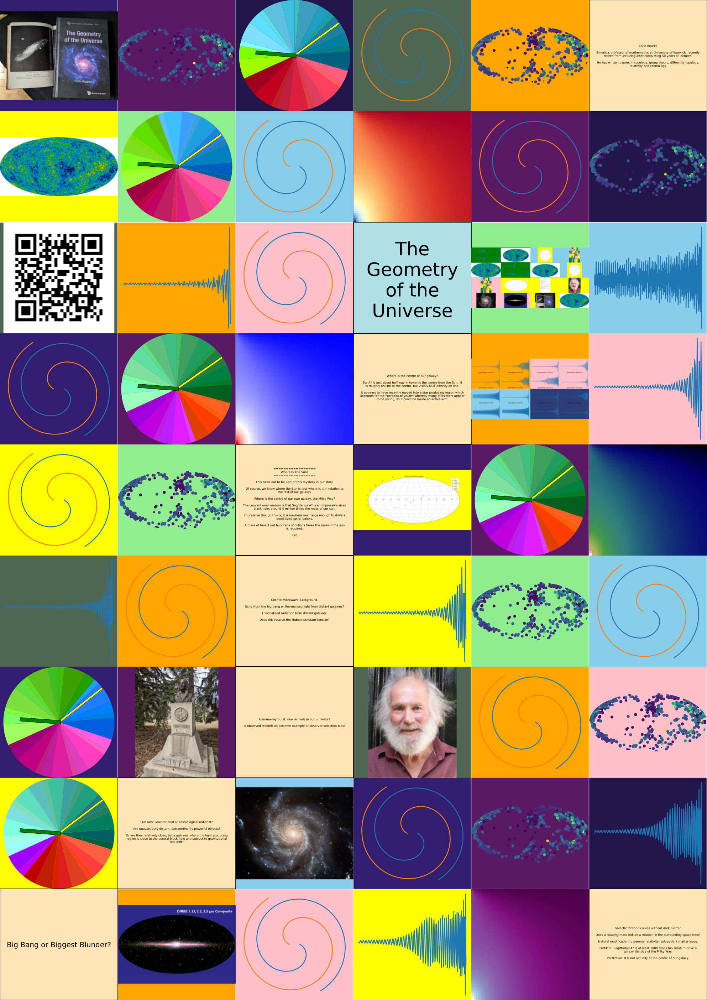

.. include:: ../README.rst

The Geometry of the Universe
============================

.. toctree::
   :maxdepth: 2

   about
   gotu
   pc

A space time trilogy
====================

Sixty years of space exploration.

.. toctree::
   
   notu

   abhot

   gotu

Cosmic Microwave Background
===========================

Black Holes
===========

A module for each chapter
=========================

.. toctree::

   tbrgb

   triangle

   events

   dss

   spiral

   quasar

   wits

   relativity

   grb

   cmb

   gaia

   bb

   observations

   jwst

Cast of Characters
==================

.. toctree::

   cast/index.rst

About the Author
================
   
.. toctree::

   cpr

Latest News
===========

.. toctree::

   news

Talks
=====

.. toctree::
   :maxdepth: 2

   talks

   101

   johnny

Interactive Examples thanks to pyscript
=======================================

Spiral galaxy `Spirals without dark matter  <_static/spiral_spiral.html>`_

Where is the Sun? `Solar System  <_static/wits_solarsystem.html>`_

Poster `poster magic <_static/poster.html>`_ for lots of fun.

Europython 2022 in dublin Poster.

Gallery
=======

.. toctree::

   gallery

Indices and tables
==================

* :ref:`genindex`
* :ref:`modindex`
* :ref:`search`
