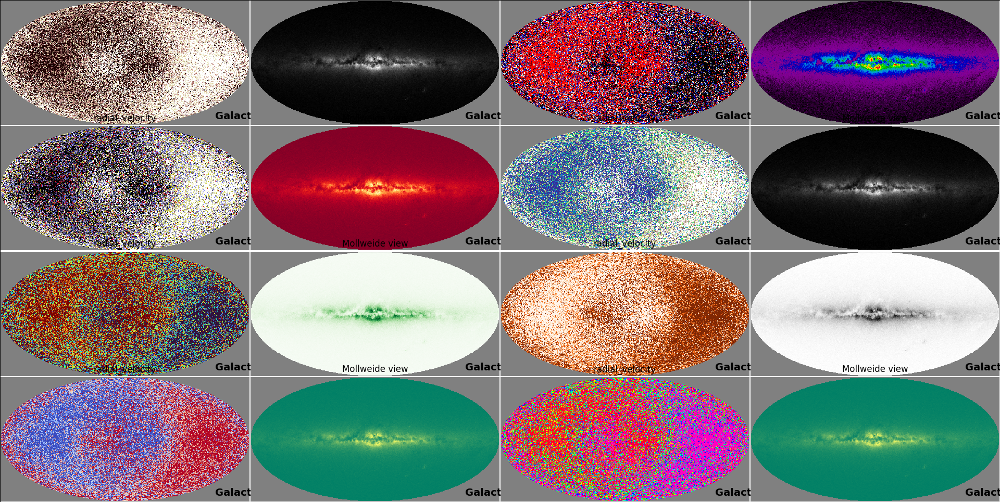

=============================================================
  Exploring the Milky Way with astropy, matplotlib and Gaia
=============================================================

.. image:: images/milkywaytalk.jpeg

A story with no beginning

A time and a place when everything started?

Johnny Gill
===========

Exploring the Geometry of the Universe.

.. image:: images/johny.png

https://github.com/swfiua

https://gotu.readthedocs.org

https://blume.readthedocs.org

swfiua@gmail.com

Thanks
======

.. image:: images/spanish_dancer.png

python
------

PyCon

PyCon Ireland

Europython 2022, Dublin
+++++++++++++++++++++++

The first pictures from James Webb arrived during the conference, good
times ahead for cosmologists.  The first picture I saw of M74.

A *Gilectomy* keynote.  No longer does python without the GIL slow
down.  A delightful talk on the problem of tracking references in a
fully multi-threaded world.

People working on *pyiodide*, I have decided to explore this project
more directly.

During the sprint I managed to get *gotu.gaia* limping along again.
I really need to unify *wits* and *gaia*.

I am starting a *gotu.jwst* module.  The plan is to be able to explore
the data behind some of the incredible images the space telescope is
giving us.

.. image:: images/m74.png
           

matplotlib
----------

Dublin, 2003

.. image:: images/table_demo.png

astropy
-------

Cosmology

Units

Constants

Coordinates

Astroquery, tables

.. image:: images/carina.png

wikipedia, open source, open data
---------------------------------

Gaia

Hubble

JWST

Astronomers
-----------

Space telescopes

Gravitational Wave Detectors

Pulsar Timing Array

Event Horizon Telescope

Personal Projects
=================

karmapi, 2016
-------------

Tools to record and display data from raspberry pi's with sensehats
and cameras.

Personal toolkit for viewing things with matplotlib.

A New Paradigm for the Universe

.. image:: images/spanish2.png

blume, 2019
-----------

Better Looking Universal Matplotlib Engine

A quest for a universal table

.. image:: images/spanish1.png

Principles
++++++++++

Do not re-invent the wheel

No module should exceed 1000 lines

Fix it upstream

Is there anything better than a folder full of 100 line python
scripts?

There is nothing a layer of abstraction cannot fix.  Can it be done
without adding complexity?

It is impossible to do anything if I obey all the principles.

gotu, 2021
----------

The Geometry of the Universe

A geometric model for the universe with no need for dark matter or
dark energy.

.. image:: images/gotu.png

What if the big bang did not happen?
====================================

Bayes Theorem
-------------

.. math::

   P(A|B) = P(B|A)P(A) / P(B)

Copernicus
----------

The Perfect Copernican Principle:

There should be no special times or places in the Universe.

A story with no beginning

A time and a place when everything started?

.. image:: images/copernicus.png

Fred Hoyle
----------

Fred Hoyle coined the term Big Bang.

He believed in an essentially static universe.

Suggested just one new atom appearing in each skyscraper sized volume
of space per year would balance the expansion.

.. image:: images/m31.png

Colin Rourke
------------

Emeritus Professor of Mathematics at Warwick University.

Good news: No need for dark matter.

Bad news: Sagittarius A* is too small to drive the Milky Way.

Colin Rourke proposes de Sitter space as a space-time which exhibits
redshift, but has no overall expansion.

Shows that the Sciama Principle can explain galactici rotation curves
without need for dark matter.

.. image:: images/cpr.jpg

Spanish Dancer
==============

NGC 1566

.. image:: images/spanish3.png

mixing download and viewing

blume.train

Milky Way
=========

Gaia and wits
=============

Where is the Sun?

Can Gaia help answer this question?

Galactic Rotation Curves
========================

Xaowei paper.

Tangential velocities beyond 25kpc from the galactic centre are lower
than expected.

.. image:: images/milkyway_rotation.png

Sciama Principle, Denis Sciama, 1953
====================================

On the origin of inertia.

A mass

.. math::

   M

with angular velocity

.. math::

   \omega

induces a rotation of:

.. math::

   M \omega / r

at a distance

.. math::

   r

from the centre of the mass.

.. image:: images/dennis_sciama.png

Sagittarius A*
==============

.. image:: images/sgrastar.png

Most observed black hole.

Black Holes

Introduction to the Geometry of the Universe
============================================

It's a big subject ;)

priors for astronomical data analysis

advert for workshop

What does a de Sitter/Sciama prior look like?

Simulate 10^7 galaxies of mass 10^15

blume

gaia

spiral

skymap

   
distance and redshift
---------------------

.. image:: images/zvr.png

           

