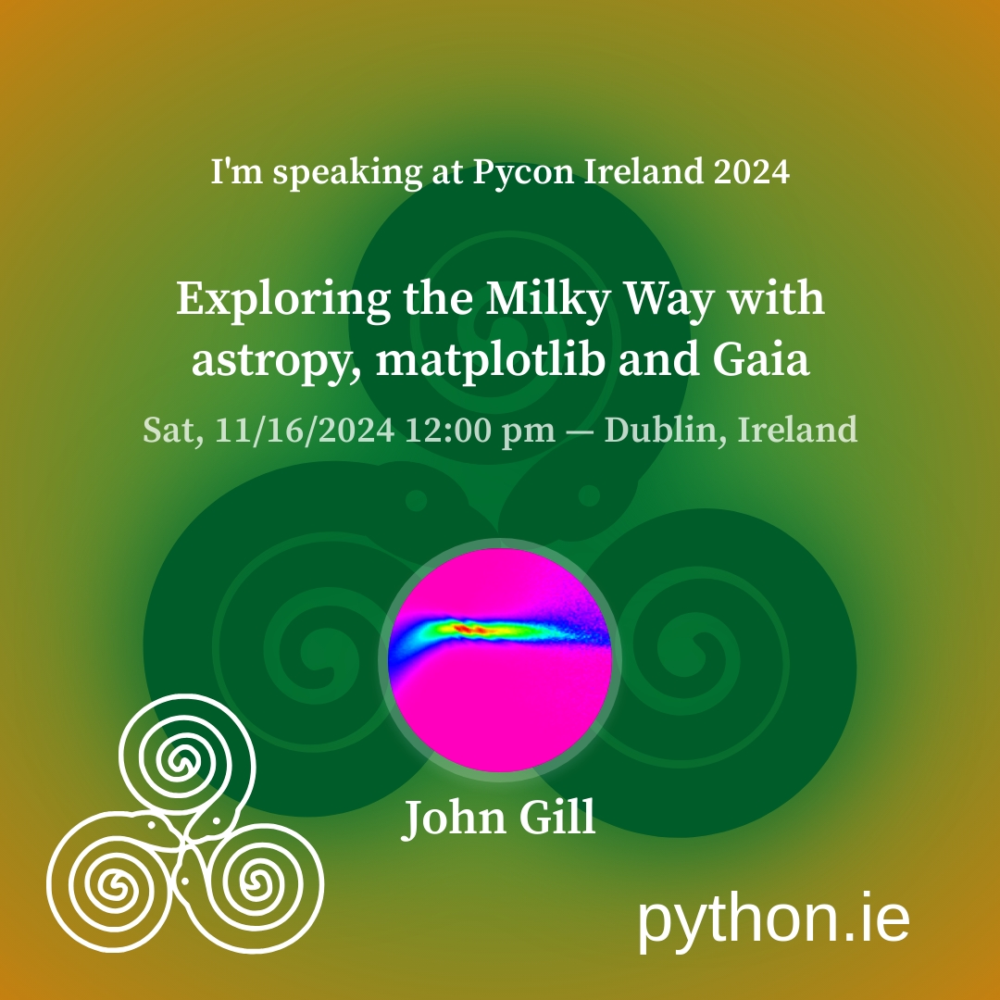
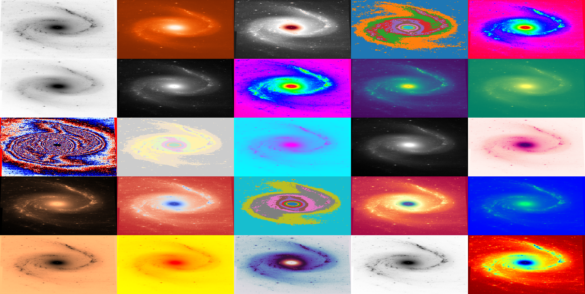
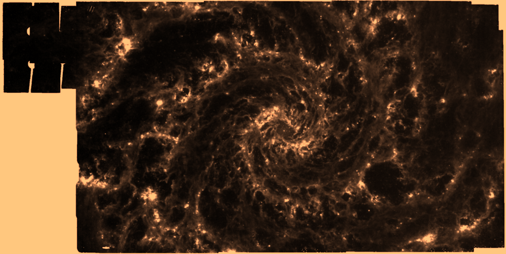
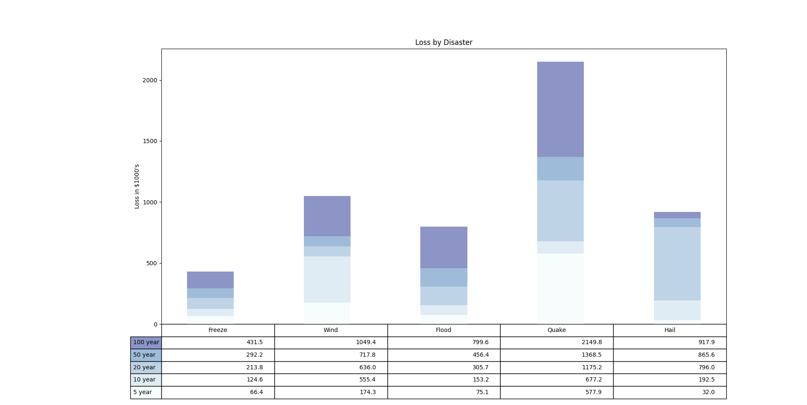
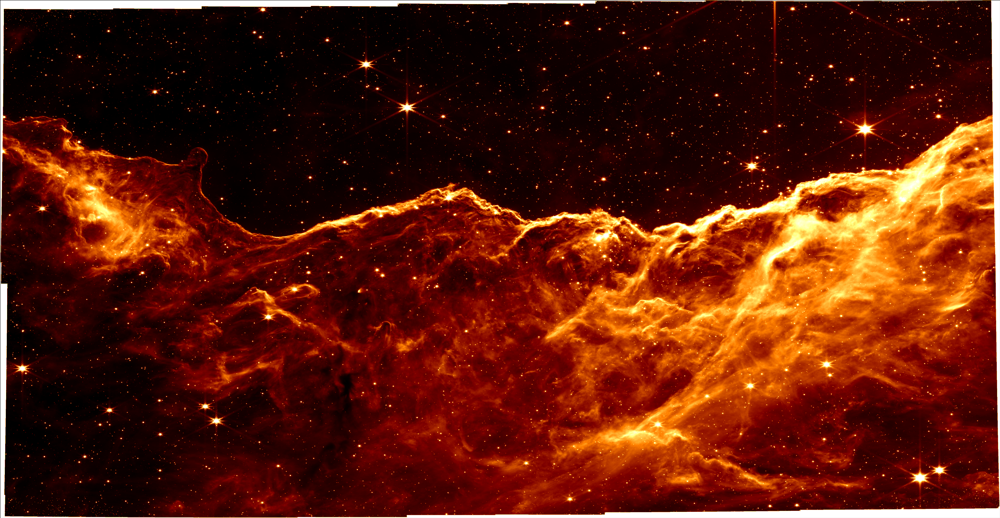
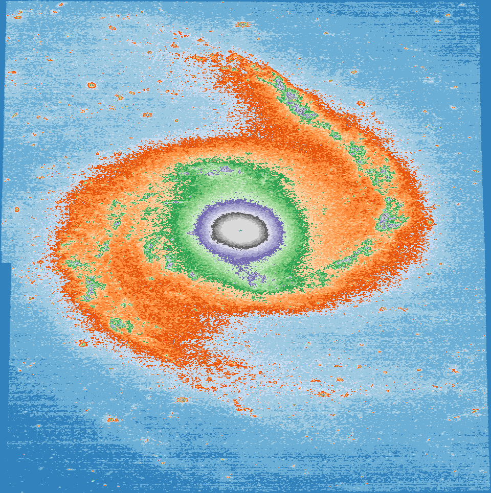
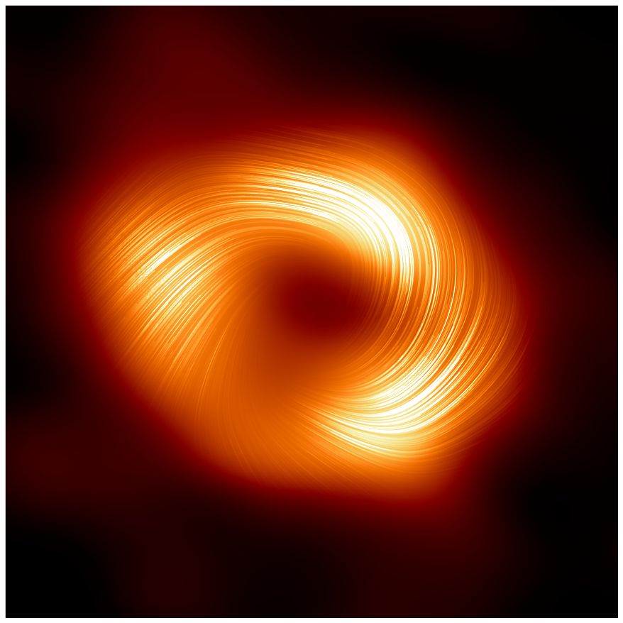

=============================================================
  Exploring the Milky Way with astropy, matplotlib and Gaia
=============================================================

A story with no beginning

A time and a place when everything started?

Thanks
======

python
------

PyCon Ireland

Europython 2022, Dublin
+++++++++++++++++++++++

The first pictures from James Webb arrived during the conference, good
times ahead for cosmologists.

The first picture I saw of M74.

A *Gilectomy* keynote.  No longer does python without the GIL slow
down.  A delightful talk on the problem of tracking references in a
fully multi-threaded world.

People working on *pyiodide*, I have decided to explore this project
more directly.

During the sprint I managed to get *gotu.gaia* limping along again.
I really need to unify *wits* and *gaia*.

I am starting a *gotu.jwst* module.  The plan is to be able to explore
the data behind some of the incredible images the space telescope is
giving us.

           

matplotlib
----------

Dublin, 2003

astropy
-------

Cosmology

Units

Constants

Coordinates

Astroquery

wikipedia, open source, open data
---------------------------------

Astronomers
-----------

Space telescopes

Gravitational Wave Detectors

Pulsar Timing Array

Event Horizon Telescope

Personal Projects
=================

karmapi
-------

Tools to record and display data from raspberry pi's with sensehats
and cameras.

Personal toolkit for viewing things with matplotlib.

.. image:: images/spanish2.png

blume
-----

Better Looking Universal Matplotlib Engine

A quest for a universal table

gotu
----

The Geometry of the Universe

.. image:: images/gotu.png

Spanish Dancer
==============

NGC 1566

.. image:: images/spanish3.png

mixing download and viewing

blume.train

**Alternate between python and cosmology, code and maths.**

Milky Way
=========

Gaia
====

Galactic Rotation Curves
========================

Xaowei paper.

Sciama
======

.. math::

   M \omega / r
   

Sagittarius A*
==============

Most observed black hole.

Black Holes

   
distance and redshift
=====================

.. image:: images/zvr.png

           

Workshop
========

priors for astronomical data analysis

advert for workshop

What does a de Sitter/Sciama prior look like?

Simulate 10^7 galaxies of mass 10^15

blume

gaia

spiral

skymap

