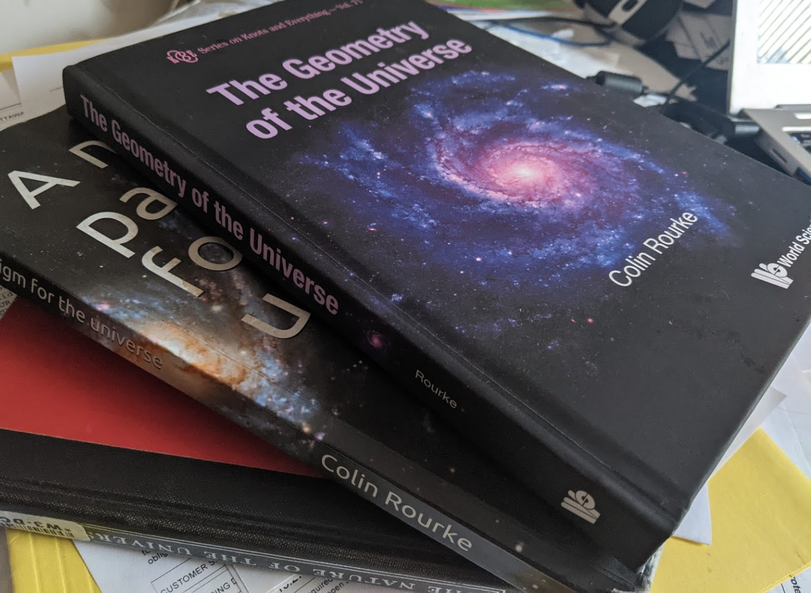

=============================================================
  Exploring the Milky Way with astropy, matplotlib and Gaia
=============================================================

.. image:: images/milkywaytalk.jpeg

A story with no beginning

A time and a place when everything started?

Thanks
======

python
------

matplotlib
----------

astropy
-------

wikipedia, open source, open data
---------------------------------

Astronomers
-----------

Workshop
========

priors for astronomical data analysis

advert for workshop

What does a de Sitter/Sciama prior look like?

Simulate 10^7 galaxies of mass 10^15
   
Europython 2022, Dublin
=======================

The first pictures from James Webb arrived during the conference, good
times ahead for cosmologists.

The first picture I saw of M74.

A *Gilectomy* keynote.  No longer does python without the GIL slow
down.  A delightful talk on the problem of tracking references in a
fully multi-threaded world.

People working on *pyiodide*, I have decided to explore this project
more directly.

During the sprint I managed to get *gotu.gaia* limping along again.
I really need to unify *wits* and *gaia*.

I am starting a *gotu.jwst* module.  The plan is to be able to explore
the data behind some of the incredible images the space telescope is
giving us.

.. image:: images/m74.png

Dublin, 2003
============

.. images:: images/table_demo

Spanish Dancer
==============

NGC 1566

.. image:: images/spanish1.png

mixing download and viewing

blume.train

**Alternate between python and cosmology, code and maths.**

Milky Way:

Personal Projects
=================

karmapi
-------

.. image:: images/spanish2.png

blume
-----

Better Looking Universal Matplotlib Engine

A quest for a universal table

.. image:: images/spanish3.png

gotu
----

The Geometry of the Universe

Gaia
====

Sciama
======

.. math::

   M \omega / r
   

distance and redshift
=====================

Patterns
========

print to debug

add complexity while figuring out how things work.

no problem a layer of indirection cannot solve

Blume
=====

Workshop
========

blume

gaia

spiral

skymap

Projects
========

