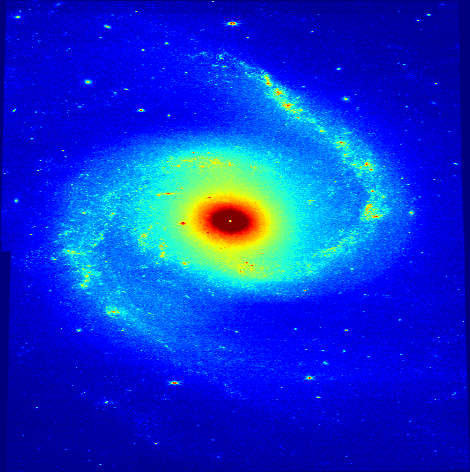
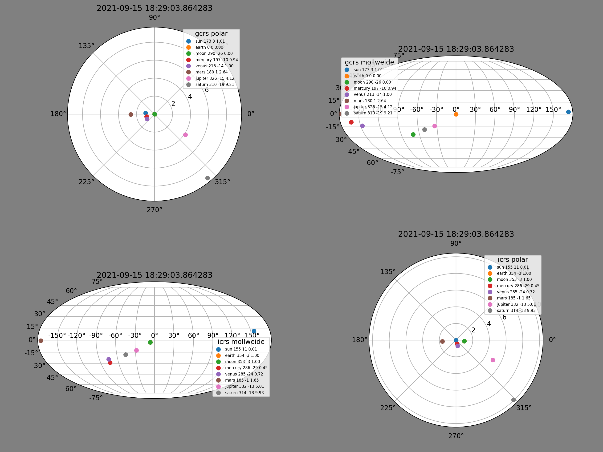
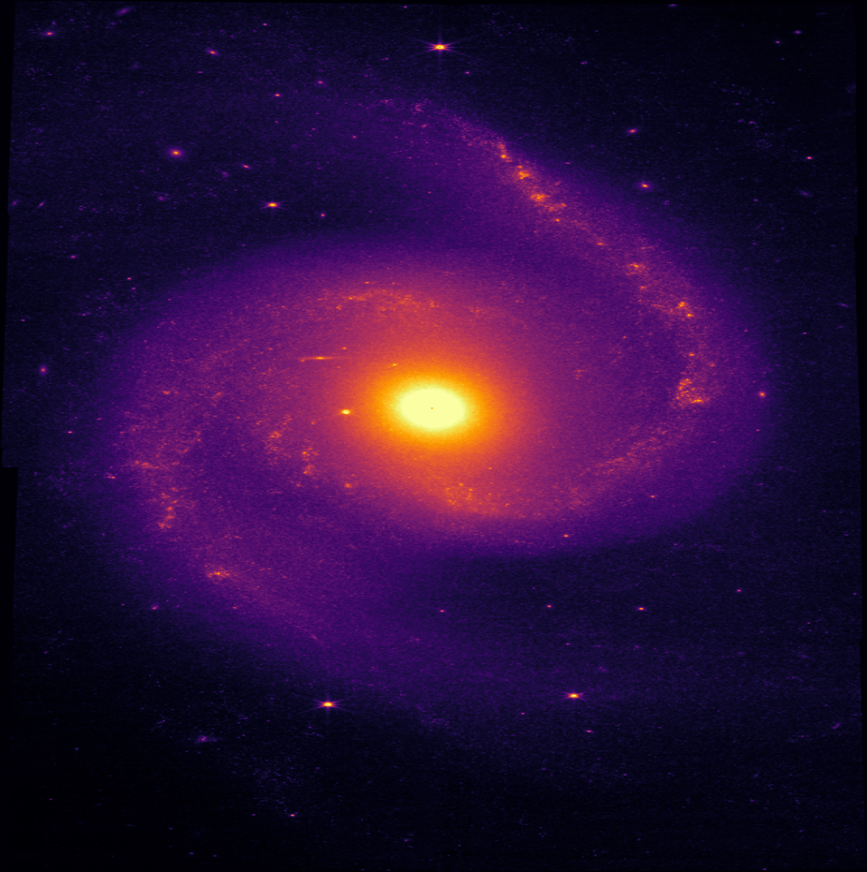
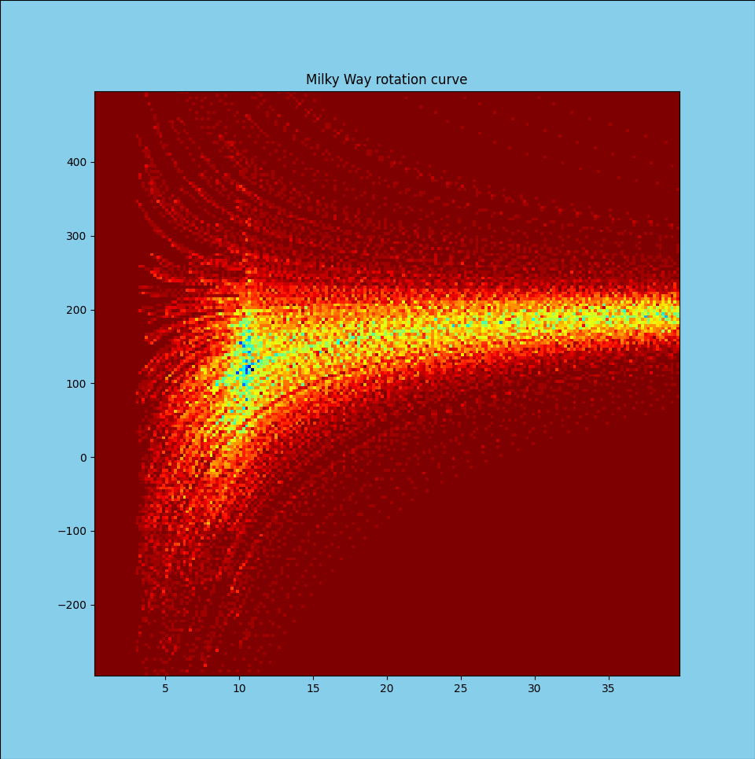

=============================================================
  Exploring the Milky Way with astropy, matplotlib and Gaia
=============================================================

.. image:: images/milkywaytalk.jpeg

A story with no beginning

A time and a place when everything started?

Johnny Gill
===========

Exploring the Geometry of the Universe.

.. image:: images/johnny.png

https://github.com/swfiua

https://gotu.readthedocs.org

https://blume.readthedocs.org

swfiua@gmail.com

Workshop: Introduction to the Geometry of the Universe
======================================================

Learn how to download JWST and other astronomical data.

Provide a guide to the key ideas in the Geometry of the Universe.

Explore gotu.gaia and healpy to visualise the Milky Way.

blume.table and how to make the magic carpet magic

Explore gotu using blume.

Thanks
======

.. image:: images/spanish_dancer.png

python
------

PyCon

PyCon Ireland

Europython 2022, Dublin
+++++++++++++++++++++++

The first pictures from James Webb arrived during the conference, good
times ahead for cosmologists.  The first picture I saw of M74.

A *Gilectomy* keynote.  No longer does python without the GIL slow
down.  A delightful talk on the problem of tracking references in a
fully multi-threaded world.

People working on *pyiodide*, I have decided to explore this project
more directly.

During the sprint I managed to get *gotu.gaia* limping along again.
I really need to unify *wits* and *gaia*.

I am starting a *gotu.jwst* module.  The plan is to be able to explore
the data behind some of the incredible images the space telescope is
giving us.

.. image:: images/m74.png
           

matplotlib
----------

Dublin, 2003

.. image:: images/table_demo.png

astropy
-------

Units

Constants

Coordinates

Cosmology

astroquery, tables

Personal Projects
=================

karmapi, 2016
-------------

Tools to record and display data from raspberry pi's with sensehats
and cameras.

Personal toolkit for viewing things with matplotlib.

2017, A New Paradigm for the Universe

blume, 2019
-----------

Better Looking Universal Matplotlib Engine

A quest for a universal table

.. image:: images/spanish1.png

gotu, 2021
----------

The Geometry of the Universe

A geometric model for the universe with no need for dark matter or
dark energy.

.. image:: images/gotu.png

What if the big bang did not happen?
====================================

What if galaxies are very much older than 13.7 billion years?

Copernicus
----------

The Perfect Copernican Principle:

There should be no special times or places in the Universe.

A story with no beginning

A time and a place when everything started?

.. image:: images/copernicus.png

Fred Hoyle
----------

Fred Hoyle coined the term Big Bang.

Believed in an essentially static universe.

One atom appearing in each skyscraper sized volume
of space per year would balance the expansion.

.. image:: images/m31.png

Colin Rourke
------------

Emeritus Professor of Mathematics at Warwick University.

No need for dark matter.

Sagittarius A* is too small to drive the Milky Way!

The Sciama Principle can explain galactic rotation curves
without need for dark matter.

de Sitter space is a space-time which exhibits redshift, but has no
overall expansion.

Bayes Theorem
-------------

.. math::

   P(A|B) = P(B|A)P(A) / P(B)

What are your priors ignoring?

           
Sagittarius A*
==============

.. image:: images/sgrastar.png

Most observed black hole.

4.2 million solar masses.

Black Holes: gotu.spiral.Spiral()

Gaia and wits
=============

Where is the Sun?

Can Gaia help answer this question?

What does the Milky Way rotation curve look like?

Spanish Dancer
==============

Solar System Rotation Curve
===========================

Milky Way Rotation Curves
=========================

Xaowei Ou paper.

Tangential velocities beyond 25kpc from the galactic centre are lower
than expected.

           
Milky Way Rotation Curve from Gaia
==================================

.. image:: images/milkyway_rotation.png

Sciama Principle, Denis Sciama, 1953
====================================

On the origin of inertia.

A mass

.. math::

   M

with angular velocity

.. math::

   \omega

induces a rotation of:

.. math::

   M \omega / r

at a distance

.. math::

   r

from the centre of the mass.

.. image:: images/dennis_sciama.png

Simulation using Gaia data
==========================

.. image:: images/paradigm.png

Introduction to the Geometry of the Universe
============================================

It's a big subject ;)

blume

gotu.jwst

gotu.gaia

gotu.spiral

Dark Energy Survey
------------------

.. image:: images/supernova.png

distance and redshift, Hubble Tension
-------------------------------------

.. image:: images/zvr.png

Laniakae Supercluster
---------------------

           

