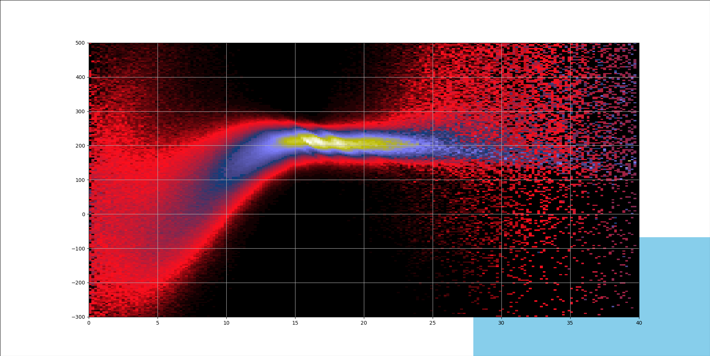

============================
 The State of this Universe
============================

I will try to give updates from time to time as to what is happening
here

16/4/2025
=========

I have signed up to attend the 24th International Conference on
General Relativity and Gravitation.

https://iop.eventsair.com/gr24-amaldi16/

There list of invited speakers is exciting and should be an enormous
help to this project.

https://iop.eventsair.com/gr24-amaldi16/speakers

There is also a science and art exhibition for which submissions are
invited, so it looks like I will be working on a poster.

I have also been working on the green valley problem :ref:`birch`, in
particular looking at the data from the Dark Energy Spectrographic
Instrument (DESI).

The data for data release 1 was recently released publicly.  The
gotu.desi module downloads data and the :ref:`bitch` module has a
viewer for the data.

2024/12/04
==========

I very much enjoyed PyCon Ireland and am super grateful for the
opportunity to talk about the Geometry of the Universe.

I have done significant work on the :ref:`gaia`, visualising the
Milky Way's rotation curve, using data from the European Space
Agency's Gaia satellite.

This includes using the :ref:`healpy` package, which provides
equal-area pixellisations of a sphere, as well as spherical harmonic
analysis.

There is a new paper out from the Pulsar Timing Array team which gives
all sky maps of the gravitational wave background based on the MeerKAT
pulsar data.  Specifically, the 4.5 year data release.

It looks like they are using healpy to both perform spherical harmonic
analysis and to display the results.

https://academic.oup.com/mnras/advance-article/doi/10.1093/mnras/stae2573/7912549

It is wonderful stuff and it is going to be fascinating as more data
accumulates over the years.  

This data provides an excellent test for the Sciama Principle.

As well as visualising the Milky Way's rotation curve, using Gaia
data, the module can do a simulation, taking a sample of stars at a
given distance from the galactic centre and projecting their future
trajectory, assuming the Sciama Principle and a large mass at the
galactic centre.

The resulting simulation fits the 200km/s assymptote well.  It remains
to model the random motions of stars on their outwards journey as well
as the curvature of the universe in the large.

.. image:: images/mwsim.png

I am still working on adding some random noise to the stars motions
and also trying to model a curved universe.

The Gaia data is a treasure trove of information to help with this.

There is also Appendix D. of the book, which looks at vertex deviation
among stars local to the Sun.

It is coming to my busy time of the year, where I am outdoors in the
snow a good deal.

My goals for the next little while are to continue the Milky Way
simulation and to explore gravitational waves generated by the Sciama
Principle in a de Sitter Universe.

2024/8/28
=========

I will be giving a talk, *Exploring the Milky Way with astropy,
matplotlib and Gaia* at Pycon Ireland in Dublin.

More information on the talk can be found here:

https://sessionize.com/john-gill

Over the summer I have been focussing on my understanding uniformly
curved space time, trying to understand what it should look like and
whether it explains the observations of the Dark Energy Survey and the
Hubble tension.

At the same time I have been working on visualisations of the Gaia
data to explore the Milky Way's galactic rotation curve.

Both of these involve two variables, the former distance and
tangential velocity, the latter redshift and distance.

2024/4/4
========

Today's date, 4**3 = 64.

It has been a busy winter of explorations.

The main module is the :ref:`spiral` module which is an evolving
galactic and galaxy simulation.

It contains most implementations of most of the key formulae from
:ref:`gotu`.

The module now include a simulation of new galaxies arriving in a de
Sitter Space universe. It produces plots of blue/red-shift against
distance for a sample of arrivals.

The goal is to understand the observations of supernovae, which gives
a good sample of galactic distances and redshifts.  This sample is
showing that there is more going on than a simple relation between
redshift and distance.  In Big Bang parlance, the expansion of the
universe has accelerated.

In the de Sitter model there only an asymptotic relation between
redshift and distance.  All the galaxies we see eventually recede at
the Hubble rate.

They burst on the scene, highly blue shifted for what is often a short
period of time before they accelerate away from us and reach the
Hubble flow.

The distribution of galaxies we see is skewed to those that have been
around a good while, and those are all approaching the Hubble flow.
More particularly, many galaxies do not hang around long enough for a
super nova event to happen.

When a new galaxy appears it is at the Hubble distance.  This is due
to the curvature of the universe.  For a galaxy beyond the Hubble
distance, most of its light bends before it reaches us.

See recent commits to the :ref:`spiral` module for more on this.

Gaia and the galactic centre
----------------------------

The :ref:`gaia` module can now download data from the ESA's Gaia
program and create plots showing the Galactic rotation curve.

The image above shows the Milky Way's rotation curve, the tangential
velocity, in km/s on the y-axis and the distance from the galactic
centre, in kpc on the x-axis.

To create the image a grid of tangential velocity (y-axis) and
distance from the galactic centre (x-axis) was created.

Counts were then done on the 33 million Gaia (data release 3), to
establish how many were in each bin.

The number of observations at each distance varies significantly as
you move out from the galactic centre, so the counts were then
normalised by dividing the count in each bin by the sum for all bins
with the same distance from the galactic centre.

The resulting grid is then plotted with :ref:`matplotlib`, which maps the
counts, now in the range [0, 1], to colours based on a colormap.

The image is stunning, a real example of how the Gaia mission creates
better insight into our own galaxy.

This image also assumes that the centre of the Milky Way is actually
twice as far away as Sgr A*, which in this image is around 8kpc from
the origin, where we see the most common tangential velocity is close
to zero.

See the :ref:`gaia` module for more on this. 

2023/12/7
=========

The big news of the year for the Geometry of the Universe was the
detection of nanohertz gravitational waves by the Pulsar Timing Array
team.

It is a stunning achievement, using pulsars across our galaxy to
detect ripples in space time with a period measured in years and an
amplitude of just 10m.

These low level gravitational waves are a prediction of the theory
presented in :ref:`gotu`.

As a result I have been using the software here to explore data
relating to the the theory.

`astropy` has been extraordinarily helpful during this time.

It really does have everything you need to explore the very latest
observations of the universe.

The `units`, `constants` and `cosmology` modules have been
particularly useful.

All the `cosmology.Cosmology` objects that are provided are instances
of the FLRW class, describes itself as *An isotropic and homogeneous
(Friedmann-Lemaitre-Robertson-Walker) cosmology*.

These provided key parameters such as the split into dark matter, dark
energy, baryonic matter, photon energy and the Cosmic Microwave
Background temperature.

For each parameter there is a corresponding function to give the value
of the parameter at a particular *redshift*, z.  In FLRW cosmology, z
is synonomous with both distance and age.

In a cosmology with the Perfect Copernican Principle,  these functions
all return the value for the current time, since it is assumed these
values are constant through time.

The :ref:`spiral.Cosmo` class is the beginnings of an attempt to build
cosmology objects for a de Sitter universe.  The default object takes
the current default cosmology from :ref:`astropy` to initialise the values
for the current time and sets up functions that return the same value
regardless of the $z$.

The :ref:`spiral.SkyMap` uses this cosmology to estimate the mass of
the universe relative to the observed stellar mass.  It uses the
*heasarc* catalogue to get estimates of stellar mass for local
galaxies. 

Using this distribution and the Sciama Principle the software
simulates the gravitational waves that the galactic centres should
create.

The intriguing bit is that the waves based on a universe of the Hubble
scale generates waves about 45 times smaller than those observed.

Which is about the same amount that the Cosmic Microwave Background is
brighter than the thermalised energy emitted by all the galaxies in
the visible universe.

In a de Sitter universe the Hubble distance is also a significant
parameter.  It is the radius of curvature of the universe.

This radius is in no way an indication of the full size of the
universe.  Light can and does travel very much farther.   At the
Hubble scale, due to the curvature, it becomes a random walk and after
N steps the expected distance from the origin is only sqrt(N) times
the step size.  So the software let's you set the factor to scale
things up by, as well as other parameters.

If you are having trouble getting things running then take a look at
the :ref:`blume` project, which is something I wrote to help me using
:ref:`matplotlib`.

2023/1/9
========

Time for a new year review of how the models presented in :ref:`gotu` are
faring under the scrutiny of the new space telescope.

Quasars
-------

As time goes on more and more of ARP's peculiar galaxies will be
observed by the JWST.

Many of these contain examples where Arp observed quasars with
intrinsic redshift, caused by the light producing region being close
enough to the central black hole to cause gravitational redshift.

With the new infrared view, we see these galaxies with a new, improved
perspective, providing stronger evidence that they are associated with
the galaxy, yet have significantly larger redshift.

Distant galaxies in deep fields
-------------------------------

Very high red-shift galaxies have been observed by the telescope, in
numbers higher than predicted by the current big bang models.

There is a lot of freedom in the big bang model, but parameters will
need to be tuned.

The observations are entirely consistent with the model proposed in
:ref:`gotu`.

There was no big bang, the universe is essentially static, it is
galaxies as far as we can see.

The universe also happens to be curved, and this does impact the
view.  With expanding and contracting fields intertwined, like an
Escher drawing.

In short, some work to do for the big bang theorists.   Galaxy
formation models need to be refined.

The static universe, with curvature too, is alive and well.

CMB
---

The Cosmic Microwave background has been in the news too.  With the
big bang model, the CMB gives the value of the Hubble constant.

The problem: other methods of calculating the constant give a value
almost 10% higher.

This is the so-called Hubble tension, an indication there's something
amiss.

The :ref:`gotu` explanation for the CMB is that it is the thermalised
radiation of all the galaxies back-lighting our view of the universe.

It is complicated by the curvature of the universe, that has a
visibility horizon at around the Hubble distance.  On top of that
there are the spherical harmonics that are observed in the CMB to
take account of.

Sgr A*
------

We already have excellent observations of this central black hole.  It
is one of the most observed objects in the Universe.  

According to :ref:`gotu`, it is a baby quasar, in the general direction of
the centre of our galaxy, but not actually at the centre.

I think in time JWST will allow us to see analogues in other
galaxies.  This is key to appreciating the true mass of black holes at
the centre of galaxies the size of the Milky Way.

Gamma-Ray Bursts
----------------

These are assumed to result from cataclysmic events, such as the
collision of neutron stars.

:ref:`gotu` gamma-ray bursts could herald the arrival of a distant galaxy
in our visible universe.

We see it's infinite past in a very short period of our time, before
the new arrival rapidly recedes according to the Hubble law.

The gravitational wave detectors have been upgraded and are ready for
another obaservational run, starting in March.

We will likely see more gamma-ray bursts with associated gravitational
waves.

If the distant rotating mass of the galaxy bursts on the scene as blue
shifted light, presumably the inertial drag that it exerts on it's
surrounding space time is also modulated in the same way.

It would be good to try and estimate what these waves actually look
like and understand any relation between a gamma-ray burst and a
gravitational wave.

2022/12/9
=========

It has been a fascinating year for this project, with the JWST
constantly in the news.

Since the first pictures in July there has been one beautiful image
after another.

The data is openly available, considered public domain.  The astropy
world has done an excellent job making everything accessible.  It
really is a wonderful time for observations of our universe.

Each JWST image also has background data, not necessarily the focus of
the particular study that proposed the observation.   By making the
data available it increases its value as more theories can be tested
with a single observation.

There is now a :ref:`jwst` module that can be used to download and
view JWST data and images.

You can pass it the name of your favourite target using the --location
option::

  python -m gotu.jwst --location  ngc1566

The module queries the MAST database to convert the name into sky
coordinates and then queries MAST again for JWST observations in that
location.

It then pops up a matplotlib figure window with a table summarising
the records that were found.

Press 'r' and it will start downloading and displaying images.

I have not got past displaying the images with matplotlib, using
random colour maps.  There is always something fascinating in these
images.

Here is a one of NGC 1566, also known as the Spanish Dancer.

.. image:: images/ngc1566.png

Recently, I have been focussing on the `dss` module, trying to
get a natural understanding of Minkowski and de Sitter space, as this
is the key to the explanation of why an essentially static universe
appears to be expanding.

For a while I have been lost in a world of Lorentz transformations,
hyperbolic rotations and curvature in five dimensions, with parallel
transport of vectors around curves in two dimensional slices.

How to visualise it all?  How to show what a curved universe looks
like?

I feel it is the key to showing that there are other universes than a
big bang universe, that fit the observations, as any argument for a
static universe needs to address red-shift.

  
2021/12/3
=========

It is very much a work in progress, an outline of ideas.

I've tamed the `sphinx`_ enough so that from here most of the
documentation will be in the form of comments in code.

I am still using some things from another of my projects `blume`_
that gives me an interactive framework to work with.  I will likely
have to change a few lines of code as blume settles down.

Here I should be able to move ahead, knowing very little will need
changing here as `blume`_ evolves.   Check the news in blume land for
how that is going.

Plans
-----

There are several pieces that need fleshing out at this point.

* :ref:`dss`, geodesics, gamma-ray-bursts and red-shift.
* :ref:`quasar`, a quasar model.
* :ref:`cmb`, a model with all the harmonics.
* :ref:`spiral`

I also want to rework my code that is downloading Gaia data, to allow
me to zoom in on a particular part of the data.

.. _sphinx: https://sphinx.readthedocs.io

.. _blume:  https://github.com/swfiua/blume

.. _matplotlib: https://matplotlib.org
