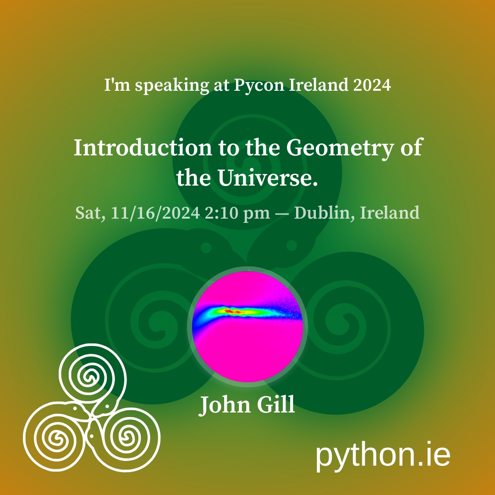

==============================================
 Introduction to The Geometry of the Universe
==============================================

Download and visualise data from the James Webb Space Telescope

Simulate the Milky Way's rotation curve assuming the Sciama Principle::

   a rotating mass induces a rotation on the surrounding space time
   with a magnitude proportional to the mass and inversely
   proportional to the 

           
Introduction to de Sitter Space

Download and visualise the supernovae data from the Dark Energy Survey

           

Introduction
============

.. image:: images/gotu.png

Johnny Gill
-----------

.. image:: images/spanish2.png

Goals
-----

Document my explorations of The Geometry of the Universe (gotu)

Visualise space-time, understand curvature.

Visualise data to see if it supports the theory.

Help others understand the ideas.

Your Goals
----------

What do you want?

Gain insight into cosmological mysteries
----------------------------------------

Hubble Tension

Dark Matter

Dark Energy

Gravitational Waves

Dark Energy

Flash Warnings
--------------

Lots of axes flying around.

Install the software
====================

Create Virtual Environment
--------------------------

mkdir workshop

python3 -m venv gotuenv

Install blume
-------------

git clone https://github.com/swfiua/blume

cd blume

python3 -m pip install -e .

Install gotu
------------

git clone https://github.com/swfiua/gotu

cd gotu

python3 -m pip install -e .

Blume
=====

Is there anything better than an editor, a console and a bunch of 100
line python scripts?

Principles
----------

No module should exceed 1000 lines

Fix it upstream

Is there anything better than a folder full of 100 line python
scripts?

There is nothing a layer of abstraction cannot fix.  Can it be done
without adding complexity?

It is impossible to do anything if I obey all the principles?

Patterns
========

print to debug

add complexity while figuring out how things work.

no problem a layer of indirection cannot solve

Not sure what value to use: use random module.

Blume Magic Module
==================

blume.magic.RoundAbout

blume.magic.Carpet

blume.TableCounts

blume.console
-------------

single character commands

.blume_history

Gotu Modules
============

gotu.jwst
---------

astroquery and mast
+++++++++++++++++++

gotu.wits
---------

gotu.spiral
-----------

gotu.gaia
---------

Observations
============

Hubble Space Telescope

Event Horizon Telescope(s)

Planck Mission

LIGO

Pulsar Timing Array

JWST
====

Gaia
====

The Milky Way Rotation Curve
============================

astropy
-------

Spiral Galaxies
---------------

Dark Energy Survey
==================

de Sitter Space
===============

Simulation of geodesics in de Sitter Space
------------------------------------------

A Glimpse of Hubble Tension?
----------------------------

Closer to home
--------------

The Laniakea supercluster of galaxies
=====================================

Priors
------

The Wiener Filter
-----------------

Combining Sciama and de Sitter
==============================

Build your own blume.train
==========================

Never have to write code to view data again.

Find away to work with the magic carpet, feed it tables of meta data,
attach it to axes and then put them into queues based on the meta
data, which must be hashable.

meta data
---------

And the matplotlib.subplot_mosaic
